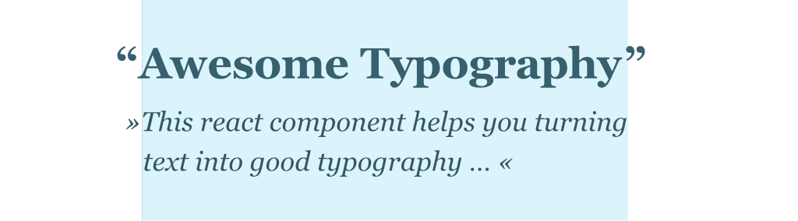

Typography matters – even in the web! This typescript react component will align words visually and replaces typical misspellings every
typographer hates! This is a react component for all who needs more control over copy texts in their apps.

<br/>
<hr/>

## Example

[](https://codesandbox.io/s/happy-driscoll-wt1gx?fontsize=14&hidenavigation=1&theme=dark)

You can also find an example app (create react app) under `./example` …

## Install

```shell
yarn add react-awesome-typography
# or
npm install react-awesome-typography
```

<br/>
<hr/>

## Usage

Just use the component like this:

```jsx harmony
import React from "react";
import AwesomeTypo from "react-awesome-typography";


const replacementRules = [
    {
        test: /(["])([^"]+)(["])/,
        replace: "«$2»",
        description: "replace wrong quotes with french ones"
    },
    // ...
];

const opticalAlignmentRules = [
    {
        id: "W", // unique name
        test: /W/, // regex to test if a word matches your rule 
        offset: -0.2 // `ch` (character) units
    }, {
        id: "Quotes",
        test: /[«]/,
        className: "your-custom-classname" // works also with classNames
    }
];

export default () =>
    <section className="container">
        <h1>
            <AwesomeTypo 
                alignmentRules={ opticalAlignmentRules }
                replacementRules={ replacementRules }
                debug={ true }
                debugOptions={ {
	                idleBgColor: "rgba(0,200,255,0.14)",
	                activeBgColor: "rgba(255,99,43,0.2)",
                } }
            >
                Good Typography in Web Won't Exists?
            </AwesomeTypo>
        </h1>
    
        <p>
            <AwesomeTypo alignmentRules={ opticalAlignmentRules }>
                "Good typography for web is really hard to accomplish .............. !" 
                But with this component, everyone can improve his/her texts without any effort. 
            </AwesomeTypo>
        </p>
    </section>
```

<br/>
<hr/>

# Documentation

## Properties

The _react-awesome-typography_ component offers the following properties / settings:

### `fixWidows` • optional

See: https://barbarakristaponis.files.wordpress.com/2015/11/typedesignquote2-e1447789973739.png
When active, adds non breaking space between last and second last words.

### `alignmentRules` • optional

Array of alignment rules to define the optical alignment behaviours for each word. Each rule object should be structured like this:

```javascript
[
    {
        id: "W", // required – the name of that rule. Believe me, you will need it in bigger projects!
        test: /^W/, // required – regex to test on every found word in the text
        offset: -0.9, // required – «margin-left» adjustment value, unit: "ch" (0-character (zero) width)
        className: undefined // optional – you can adjust words by using classes too 
    },
    // ...
]    
```

### `replacementRules` • optional

Rules to fix and replace misspellings by using regular expressions: 

```javascript
[
    {
        description: "replace wrong quotes with french ones", // required – the description of that rule. Believe me, you will need it in bigger projects!
        test: /(["])([^"]+)(["])/, // required – regex to test on every found word in the text
        replace: "«$2»", // required – can be string or function, see: https://developer.mozilla.org/en-US/docs/Web/JavaScript/Reference/Global_Objects/String/replaceAll#description  
    }
    // ...
]    
```

mainDelimiter: string,
	fixWidows: boolean,
	breakInnerWordRegex: RegExp,

### `debug` • optional

*Default:* `false`
*Description:* Renders the affected words with a background-color to see which elements are optical aligned. When default, aligned words are colored red, idle words are colored
blue.

### `debugOptions` • optional

*Description:* Set background colors for debug mode:

```javascript
[
    {
        idleBgColor: "rgba(0, 200, 255, 0.14)",
        activeBgColor: "rgba(255, 99, 43, 0.2)"  
    }
]
```

# Feel free to contribute!

It would be an honor working with you!

# ToDos

- [x] Add Feature: Optical alignment (`alignmentRules`)
- [x] Add Feature: Replace typical misspellings (`replacementRules`)
- [x] Fix multiline word breaks when using special html entities in word
- [x] Fix component rerenders when children changes
- [ ] Add more default `replacementRules`
- [ ] Add more default `alignmentRules`
- [ ] Write tests
- [ ] Add support for rtl text
