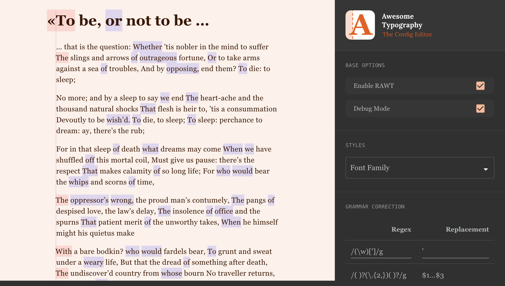

<br/>
<br/>

<p align="center">
    
</p>

<br/>

> Typography matters – even on the web. This typescript react component will
> align words visually and replaces typical misspellings every typographer hates.
> This is a react component for all who needs more control over copy texts in
> their apps.

⚠️ _This plugin is not production-ready! Support highly appreciated_  ❤️️

<br/>
<hr/>

## Current State of this Project

This plugin is currently under construction and not production-ready. 

## Figma Design

I’ve created a figma design for the config editor. The design isn’t fully implemented yet. If you want I can grant you access to the figma files to work together on the design 🥳!

[**Figma Prototype →**](https://www.figma.com/proto/Ip1ZScLgGiaGIDKu7QuHdZ/Editor?node-id=11%3A3&scaling=min-zoom&page-id=0%3A1)

## Font Config Editor



To run the editor, install the npm modules in both of the root and editor
directories:

```shell
# install npm deps under both dirs:
yarn # npm i
yarn --cwd editor
```

Then start from

```
# start
yarn start # npm run start
```

<br/>
<hr/>

## Install

```shell
yarn add react-awesome-typography
# or
npm install react-awesome-typography
```

<br/>
<hr/>

## Run tests

```shell
yarn test # npm run test

# or in watch mode:
yarn test:watch # npm run test:watch
```

[//]: # (## Usage )

[//]: # ()

[//]: # (Just use the component like this:)

[//]: # ()

[//]: # (```jsx harmony)

[//]: # (import React from "react";)

[//]: # (import AwesomeTypo from "react-awesome-typography";)

[//]: # ()

[//]: # ()

[//]: # (const replacementRules = [)

[//]: # (	{)

[//]: # (		test: /&#40;["]&#41;&#40;[^"]+&#41;&#40;["]&#41;/,)

[//]: # (		replace: "«$2»",)

[//]: # (		description: "replace wrong quotes with french ones")

[//]: # (	},)

[//]: # (	// ...)

[//]: # (];)

[//]: # ()

[//]: # (const opticalAlignmentRules = [)

[//]: # (	{)

[//]: # (		id: "W", // unique name)

[//]: # (		test: /W/, // regex to test if a word matches your rule )

[//]: # (		offset: -0.2 // `ch` &#40;character&#41; units)

[//]: # (	}, {)

[//]: # (		id: "Quotes",)

[//]: # (		test: /[«]/,)

[//]: # (		className: "your-custom-classname" // works also with classNames)

[//]: # (	})

[//]: # (];)

[//]: # ()

[//]: # (export default &#40;&#41; =>)

[//]: # (	<section className="container">)

[//]: # (		<h1>)

[//]: # (			<AwesomeTypo)

[//]: # (				alignmentRules={ opticalAlignmentRules })

[//]: # (				replacementRules={ replacementRules })

[//]: # (				debug={ true })

[//]: # (				debugOptions={ {)

[//]: # (					idleBgColor: "rgba&#40;0,200,255,0.14&#41;",)

[//]: # (					activeBgColor: "rgba&#40;255,99,43,0.2&#41;",)

[//]: # (				} })

[//]: # (			>)

[//]: # (				Good Typography in Web Won't Exists?)

[//]: # (			</AwesomeTypo>)

[//]: # (		</h1>)

[//]: # ()

[//]: # (		<p>)

[//]: # (			<AwesomeTypo alignmentRules={ opticalAlignmentRules }>)

[//]: # (				"Good typography for web is really hard to accomplish .............. !")

[//]: # (				But with this component, everyone can improve his/her texts without any effort.)

[//]: # (			</AwesomeTypo>)

[//]: # (		</p>)

[//]: # (	</section>)

[//]: # (```)

[//]: # ()

[//]: # (<br/>)

[//]: # (<hr/>)

# Documentation

## Properties

The _react-awesome-typography_ component offers the following properties /
settings:

### `fixWidows: boolean = true` • optional

See: https://barbarakristaponis.files.wordpress.com/2015/11/typedesignquote2-e1447789973739.png  
When active, adds non breaking space between last and second last words.

### `alignmentRules: AlignmentRule[]` • optional

Array of alignment rules to define the optical alignment behaviours for each word. Each rule object should be structured like this:

```javascript
[
	{
		id: "W", // required – the name of that rule. Believe me, you will need it in bigger projects!
		test: /^W/, // required – regex to test on every found word in the text
		offset: -0.9, // required – «margin-left» adjustment value, unit: "ch" (0-character (zero) width)
		className: undefined // optional – you can adjust words by using classes too 
	},
	// ...
]    
```

### `replacementRules: ReplacementRule[]` • optional

Rules to fix and replace misspellings by using regular expressions:

```javascript
[
	{
		description: "replace wrong quotes with french ones", // required – the description of that rule. Believe me, you will need it in bigger projects!
		test: /(["])([^"]+)(["])/, // required – regex to test on every found word in the text
		replace: "«$2»", // required – can be string or function, see: https://developer.mozilla.org/en-US/docs/Web/JavaScript/Reference/Global_Objects/String/replaceAll#description  
	}
	// ...
]    
```

### `mainDelimiter: string` • optional
	fixWidows: boolean,
	breakInnerWordRegex: RegExp,

### `debug` • optional

*Default:* `false`
*Description:* Renders the affected words with a background-color to see which elements are optical aligned. When default, aligned words are colored red, idle words are colored
blue.

### `debugOptions` • optional

*Description:* Set background colors for debug mode:

```javascript
{
	idleBgColor: "rgba(0, 200, 255, 0.14)",
		activeBgColor: "rgba(255, 99, 43, 0.2)"  
}
```

# Feel free to contribute!

It would be an honor working with you!

# ToDos

- [x] Add Feature: Optical alignment (`alignmentRules`)
- [ ] Add Feature: Preserve Orphans (`fixWidows`)
- [ ] Add Feature: Replace typical misspellings (`replacementRules`)
- [ ] Fix multiline word breaks when using special html entities in word
- [ ] Add Feature: Find syllables and softwrap them (using `&shy;`)
- [ ] Add Feature: support for rtl text
