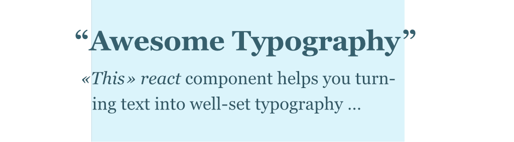

Typography matters. Even on the web. This is a `react component` for all typography nerds, who wants to have more control over  texts on websites and web apps.

## Example

[](https://codesandbox.io/s/broken-waterfall-7bqi0?fontsize=14&hidenavigation=1&theme=dark)

## Install

```shell
yarn install optical-aligned-text
# or
npm install optical-aligned-text
```

## Usage

Just use the component like this:
```jsx harmony
import React from "react";
import OpticalAlignedText from "optical-aligned-text";


const rules = [
  {
		name: "W", // just to find rules faster
		test: /^\n?W/, // regex to test if a word starts with `W` 
		offset: -0.25 // `ch` (character) units
	}, {
		name: "Quotes",
		test: /^\n?([»«„“])/,
		offset: -0.9
	}
];

export default () => 
  <OpticalAlignedText rules={ rules }>
    <section className="container">
      <h1>Willy Wonka!</h1>
      <p>«What the hell is going on here?»</p>
      <p>
        This is a normal aligned text. Can you see <br/>
        the difference to the paragraph above (left text box side)?
      </p>
    </section>
  </OpticalAlignedText>;
```

# Documentation

## Properties

The OpticalAlignedText component offers the following properties:  

### `rules` • required  
*Description:* Array of objects to define the optical alignment behaviours of each word. 

#### Each rule object should be structured like this:
```javascript
{
  name: "W" // optional – the name of that rule. Believe me, you will need it in bigger projects!
  test: /^\n?W/, // required – regex to test on every found word in the text
  offset: -0.9 // required – «margin-left» adjustment value, unit: "ch" (x-character width)
}
```

### `affectedTags` • optional  
*Default:* `["h1", "h2", "h3", "h4", "h5", "h6", "p", "em"]`  
*Description:* Html tags that should be checked.

### `debug` • optional  
*Default:* `false`
*Description:* Renders the affected words with a background-color. Aligned words are colored red, idle words are colored blue.


### `debugAlignedWordBackground` • optional  
*Default:* `"#ff9169"`
*Description:* Color for the affected words background in debug mode.

### `debugIdleWordBackground` • optional  
*Default:* `"#d0f4ff"`
*Description:* Color for the idle words background in debug mode.

# Feel free to contribute!

Please feel free to develop this plugin together 🥳!

# ToDos

- [ ] Write tests
- [ ] Add support for rtl text
- [ ] Improve performance. It isn’t that bad, but it could be better!
- [ ] Fix multiline word breaks when using `&shy;` html entities
- [ ] Fix component rerenders. Currently it’s not supported to rerender the children of `<OpticalAlignedText>` component
- [x] Main functionality